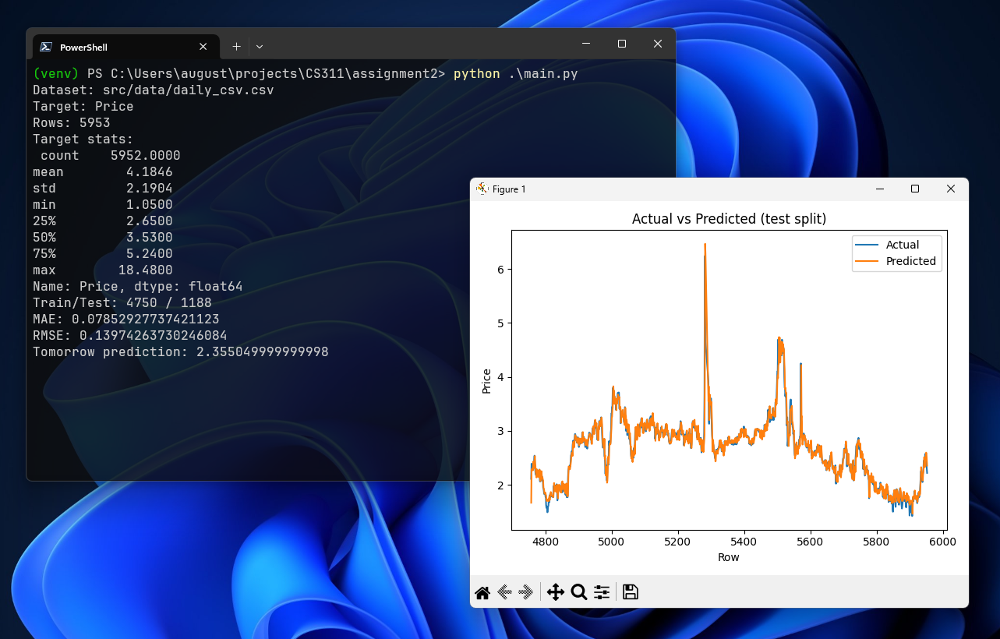

Stasiu Tippett

Computer Science 311

March 3, 2026

Price Prediction App

Introduction

This project is a natural gas prediction application. We start with a
training data set of historical daily or monthly closing prices. The
application uses a random forest algorithm to create a model of past
natural gas prices based on the data set and predicts the next day’s
price. In addition, it provides statistics about the data set and
includes a visualization chart to make it much more readable. This kind
of prediction model would have a myriad of use cases in business finance
and logistics as well as other fields. For example, how can a business
know what it is going to spend in the future if the price in the future
is unknown. Prediction models can give planners at least an idea of what
to expect. On the other hand, in the case of financial speculation being
able to predict future prices would be the Midas touch for hedge funds
or commodity traders making prediction models a powerful tool used in
some of those cases. In a logistics use case, knowing the price of
things could provide context for where it is most worthwhile to
transport goods to and what costs will be associated with the transport
expense.

Algorithms Used

Prediction seems like the realm of fortune tellers with magical powers
of researchers who have tons of disconnected information that affects
other information but for machine learning it is neither. Instead, it
simply looks at the value being predicted in the past and infers from
past relations what the data in the future is likely to be. For this
machine learning application, the algorithm used was Random Forest.
Random forest creates a collection of trees in the case of this project
200. Each tree is made up of a different random batch of data the
branching is made up of different input features. Once completed the
trees are averaged to get the prediction. The Random Forest algorithm is
best suited for this data set because it handles nonlinear data
relationships well. Also, it tends to be more resistant to overfitting
when more training runs or performed. It is also a strong contender when
the dataset contains relatively few features like was the case with the
dataset used in this project. It is applicable for datasets that do not
have an assumption for the distribution of the data like normal form or
left or right distribution. If the data is more spread-out Random
Forest, is a good call.

Dataset Information

The dataset for this project was acquired and downloaded from
[Kaggle](https://www.kaggle.com/datasets/tunguz/natural-gas-prices).
Kaggle is a data science website that has a lot of code and data sets
which can be downloaded and used for projects. For this project a CSV
was downloaded it contains the historic prices of Natural Gas. The
dataset covered time between January 7, 1997 through September 1, 2020.
The records in the dataset correspond to the total number of rows in
each CSV files used. The data set has daily records and monthly. For
this project the daily records were used. There was a total of 5953
records contained in it. Each record in the original data set had two
features. One feature for date and the other for price. The project used
lag features to model the recent trends.

| Name  | Description           | Data Type |
|-------|-----------------------|-----------|
| Price | Today’s price         | Float     |
| Date  | Today’s date          | String    |
| Lag1  | Price from 1 day ago  | Float     |
| Lag2  | Price from 2 days ago | Float     |
| Lag3  | Price from 3 days ago | Float     |
| Lag4  | Price from 4 days ago | Float     |
| Lag5  | Price from 5 days ago | Float     |
| Lag6  | Price from 6 days ago | Float     |
| Lag7  | Price from 7 days ago | Float     |

The data set being worked with in this project is pretty simple. Despite
its simplicity it needs to be described in detail. The data CSV contains
two columns containing the data. It is time series data so one column is
the date and the other is the price. The date column is a string and the
price is a floating point number. The date could be switched to date
time data type if needed. The price floating point represents the per
unit price of gas on the corresponding date. The data set is simple but
suitable for this project. The engineered features of the project are
very important due to the fact that we only have one column that is
numeric. The fundamental logic behind the training of this module is
that the price history contains data about how the price will perform in
the future. Compounding this trend into the model is the ultimate goal.

Tools and Libraries

This project only uses three tools that are outside of pythons built in
tools. Python projects tend to stack up the dependencies, but this
project is able to get it done with just three.

- Pandas

- matplotlib

- scikit-learn

Pandas is a data handling library the that allows programs to move data
sets from file into memory in what are called data frames. Commonly
abbreviated as df. It is incredibly powerful and is used for many
machine leaning and data analytics tasks.

Matplotlib is a data charting and visualization library that is used to
easily display data in python programs and notebooks. Although there are
better and more contemporary libraries that can do the same thing with
better charts Matplotlib is definitely the industry standard.

Scikit-Learn is a simple machine learning library with a myriad of
easily accessible. This library abstracts so much and put powerful
algorithms at your disposal with a few simple lines of code.

Design and Implementation

The design implementation of this program is sleek and follows a logical
flow to handle the information. The philosophy used in programming was
to keep thing minimal and directly to the point with no frills to it
while still doing everything required well. The flow of data is intended
to be from a CSV file containing price data of natural gas through to a
trained model with the capability to predict the future price of natural
gas. The first step is to use Pandas to load the data into a data frame
and assign the column that is supposed to be predicted. The script uses
a simple loop to look for the correct column for the prediction. It
searches for the price and close keywords. At this point the information
about the dataset is printed to the terminal. This helps to ensure the
data is loaded properly and nothing has gone wrong. Potential problems
would be a problem with opening the file or permissions or it could be a
problem with the data itself being corrupted or incompatible with the
script. If something goes wrong, giving the user feedback is quite
valuable. Now the program turns to working on the model itself. To begin
with the engineered features. They consist of a lag of seven days. This
is done by creating a matrix where each row is a day’s price covering
the last seven days. These prices are paired with the current day’s
price. If any rows are shifted, they are removed to which will keep the
training data clean. Given that the data itself is in order because of
its time series data the training data is split based on time and not
randomly. The training testing split is the standard eighty twenty
split. With this split the model is trained on the first eighty percent
then the trained model is tested on the remaining twenty percent to
insure it actually has prediction power. Now that the data is divided up
it is passed to the training algorithm itself. In this case it is a
Random Forest Regressor that contains two hundred trees. The training is
preformed with the lag feature. The model is then evaluated against the
test data. For the last two part step the script prints the prediction
for the price of natural gas on the day following the end of the data
set and a chart depicting the actual price and the predicted price. The
tomorrow prediction is made using the lag feature to give a predicted
price. The chat is created using the Matplotlib library. It is always
crazy seeing how much can be done with just a few lines of code when
taking advantage of powerful tools like this library. The chart really
gives a lot more context than simply printing numbers to the terminal.
Overall, the script ends up being like fifty lines of code and still is
able to get the needed work done. In particular scikit-learn abstracts
away a lot of the complexity of the machine learning algorithms that can
be encountered with cutting edge libraries like PyTorch. It is really
empowering to be able to access machine learning algorithms with only a
few lines of code. This is the power of Python and select libraries when
handling data and machine learning.

Running Instructions

Running the app is pretty straightforward. First navigate to the
projects GitHub repe then clone it on to your machine. Besides python3
there are only three other dependencies that need to be installed.

- Pandas

- matplotlib

- scikit-learn

These can be installed by running “pip install pandas matplotlib
scikit-learn”. It may be best to install using an environment or install
globally based on your preference. The data set is fairly small so it
was not added to the git ignore and will therefore come with the repo.
It could otherwise be acquired from Keggel. Once the dependencies are
installed run “python main.py”. The terminal will display data
pertaining to the dataset and the MAE and RMSE. The next day’s
prediction will then be displayed. Lastly matplotlib will display a
chart showing the predicted price compared to the actual price.

Results

The project has two kinds of results after the inference is run. First
the consol output then the chart. The consol output summarizes the data
and describes how accurate the training was. The output also has the
file name and other information about the data set. The graph uses
Matplotlib to display the data set and the prediction made by the model.
The graph has colors and compares the two. There are some statistics
about the data set including mean, standard deviation, minimum and
quartiles. Having access to this information allows the user to ensure
the data is loaded correctly and the model was able to perform its
training. Given that the price in the data set is denominated in dollars
it is important not to stray too far from thinking about things in
dollars. Looking at a raw number can distract too much from the dollar
or cent value.

After the features are loaded the script next moves on to do the
training. After it completes it displays the actual metrics of the
model. The model has a Mean Absolute Error (MAE) of 0.0785 meaning the
difference between the actual price and the prediction. In this case it
is approximately eight cents most of the time. On the other hand, Root
Mean Squared Error (RMSE) amounted to 0.1397. The RMSE is like the MAE
except it uses square roots thus punishing larger differences more as
they get bigger. That makes it more sensitive to large errors for a
short time. These numbers show the that the predictions are fairly
accurate except for a few days when the predictions were off by more
than the average.

They say a picture is worth a thousand words and that holds true in the
world of data. In this project the graph gives a visual representation
of the data and model being worked with. The graph also corroborates the
information that was printed to the terminal. The chart shows two lines
one represents the data in the data set. While the other one represents
the prediction made by the model. It takes a glance to see how the two
compare. It is evident that they correlate very closely. This shows that
the model is able to generally predict the movement of the data. One
noticeable thing is that the line representing the prediction is
smoother than the actual data turned out to be, this celebrates the RMSE
being higher than the MAE. Lastly the script logs a next day prediction
to the terminal. This prediction comes from the most recent set of price
history. This is the models educated guess on what the price will be the
day after the end of the data set. It has a label saying tomorrow’s
prediction on it making it clear what it is.

Insights

The Random Forest model was able to track the data quite closely. The
MAE was 0.0785. MAE is the difference between the predicted price and
the actual price. The Root Mean Squared Error (RMSE) was 0.1397. RMSE is
like the MAE but it penalizes larger errors more because it uses square
roots. In the dataset the price had a range between \$1.05 to \$18.48.
The MAE being approximately 0.08 means that the price prediction stayed
around 8 cents from what the price ended up being. This is small
compared to the total price range. The RMSE ended up being larger
because it penalizes larger errors. This would suggest that the model is
inaccurate for short periods of time, probably around the spiking price
changes where it swings back and forth. This can be verified by looking
at the chart. The price is harder for it to predict around rapid changes
using short term history.

There are a few limitations that jump out about this project. Firstly,
the model only predicts based off historical data in this case lagging
seven days. The model doesn’t contain any external data like supply and
demand indicators. Other external data that could give the model more
insight would be storage level, weather, seasonality and economic
factors. Second, the lag window of seven days is simple and easy to
train but may not give the model as much context as longer windows. A
larger window would be able to predict repeating patterns that play out
over weeks or months. Third, the Random Forest may not be the optimal
algorithm for this use case. There are algorithms that are designed to
be used especially with time series data. These special algorithms
actually have the ability to store patterns that can be directly found
when they are repeated. An example of a more optimized algorithm would
be Long Short-Term Memory (LSTM). AS is evident by the name it has
memory which allows that algorithm to memorize patterns and predict them
if they come back cyclically. Finally, the hyperparameters used in
training were default except for the number of trees. Hyperparameters
are the knobs for training a model so more tuning of them can result in
a better trained model. Good examples of hyperparameters that could
improve performance are max_depth, min_sample_leaf and n_estimators. The
max_depth controls how the model overfits. The min_sample_leaf requires
each leaf to contain more points. And lastly, n_estimators is the number
of decision trees giving more trees can make the predictions more stable
but only to a point.

There are a few obvious steps that could be taken to improve this
project. One good one would be to other engineered features like a
rolling standard deviation or momentum features. Momentum features in
particular would help the model with its weak point of the price rapidly
changing direction. A very powerful improvement would be adding more
pieces of price information. An example of price related data would be
sales volume. Adding volume to the price data would basically give an
added dimension to the model unfortunately this data set does not
contain volume data. Finally, an expansive improvement would be to train
multiple models and compare their performance and use the most optimal
model for actual predictions. This is how real-world data scientists
would do it. Examples of algorithms that could be compared are Support
Vector Regression, XGBoost, Linear Regression and ExtraTreeRegressor.
Training and comparing all of these would be fun and interesting but
would be quite a large project.

References

Tunguz, B. (2021). *Natural gas prices* \[Data set\]. Kaggle.
<https://www.kaggle.com/datasets/tunguz/natural-gas-prices>

Matplotlib developers. (n.d.). Matplotlib documentation. Retrieved
February 28, 2026, from https://matplotlib.org

pandas development team. (n.d.). pandas documentation. Retrieved
February 28, 2026, from https://pandas.pydata.org

scikit-learn developers. (n.d.). scikit-learn documentation. Retrieved
February 28, 2026, from https://scikit-learn.org

Ntokos, A. (n.d.). *Supervised learning in machine learning*. Study.com.
<https://study.com/academy/lesson/supervised-learning-in-machine-learning.html>

Perkins, S. (n.d.). *Neural networks in machine learning: Uses &
examples*. Study.com.
https://study.com/academy/lesson/neural-networks-in-machine-learning-uses-examples.html

Breiman, L. (2001). Random forests. *Machine Learning, 45*(1), 5–32.
https://doi.org/10.1023/A:1010933404324

