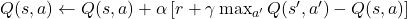
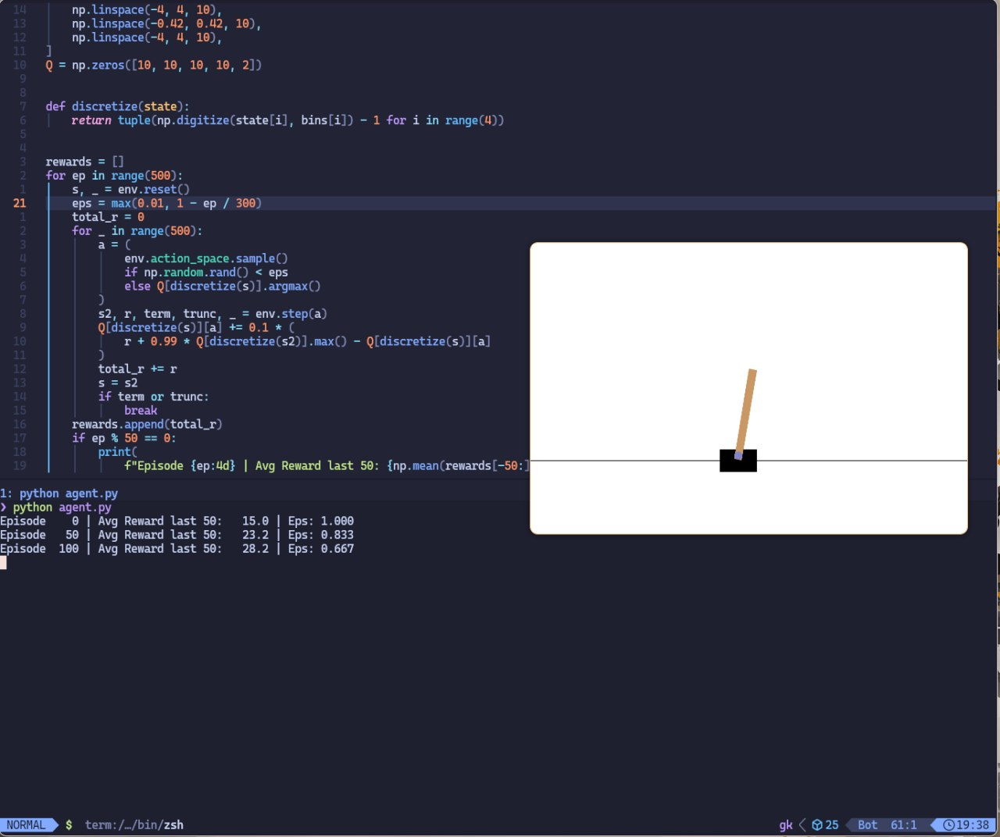

Stasiu Tippett

Computer Science 311

March 17, 2026

Cart agent

Purpose of the Agent

The goal of this project is to train an agent to balance a pole on a
cart. This is a perfect opportunity to demonstrate reinforcement
learning through trial and error of the machine learning algorithm.
Although it would be fun to get a physical cart and let the agent play
with it, for the purposes of this project, we are going to go to the
digital world. A virtual cart gives us a lot of options and
opportunities to let the agent train. The agent has the goal of keeping
the pole upright and it understands it can move the cart forward and
backward to balance the pole. Given this and an algorithm to learn, the
agent will build a model that's able to balance the pole on the moving
cart.

The script allows the agent to have 500 episodes to practice balancing
the pole. The agent does not have hard-coded knowledge of the physics of
its environment or how a pole should be balanced. All it knows is
keeping the pole upright is the desirable state. The agent then uses
trial and error to try different movements and see which movements best
balance the pole upright. Providing a goal and then letting a machine
algorithm learn is the power behind reinforcement learning that drives
many of the advances seen in AI today.

This project uses a reinforcement learning algorithm called Q-Learning.
This algorithm makes decisions based on trial and error and then creates
a table of cumulative rewards. Once an action is performed, the future
value of that action is updated to correspond with the consequences of
the action. In this way, the algorithm judges each action based on the
environments change in the future.

Algorithms Used

For this project, the algorithm used was Q-learning. The cart game has a
simple and defined action space, simply moving the cart left and right.
Additionally, the positions of the pole when broken down into chunks of
10 has a simple defined state space. Having a clearly defined action and
state space is optimal for the Q-learning algorithm. This makes neural
network dependencies unnecessary. It also makes the code clearly
readable, and the actual parts of the algorithm can be seen in the code
itself instead of a function call to a framework.

Above is the Bellman equation, which was named after Richard E. Bellman.
It is commonly used for dynamic programming, and it is also the logic at
the heart of the Q-learning algorithm. When looking at it in math
notation, it may be a bit intimidating. However, it is simply the Python
code in a different notation. Line 30 in the script is this equation
written in Python. The S represents the state. The A represents the
action the agent took in the environment. The algorithm associates a
reward value with action taken at given states. Because the next state
can be seen at this point, a value of how well the goal is achieved can
be ascertained.

In reinforcement learning, we have agents instead of models. So like the
name, the agent is able to take actions in its environment. At the
beginning of training, the agent does not know anything, so it takes
random actions. As the Q-table builds, the agent is able to reference
past states and how its actions changed the given state. As the agent
performs more actions, it takes fewer and fewer random actions and
begins to rely more on the queue table to make its actions. This is
visible on line 21 where we can see how the probability of random
actions decreases as the episode count rises.

Dataset Information

A lot of the time in machine learning and AI, there's a data input that
trains the model. However, with reinforcement learning, the environment
is itself the data set, and the agent goes into the environment and
interacts with the environment which generates the data in order to
train. This is very different from having a pre-packaged data set from
Keggle Instead, the agent's interaction with the cart and the pole
generate data which the agent uses to train on how to handle the inputs
and what responses the inputs will get.

The number of records that are usable data for the agent to interact
with depends on the runs. In the case of this script, there is a total
of 250,000 transitions. Hold up, what are transitions, you may ask?
Transitions are the simplest unit of movement in the environment the
agent is acting in. In the case of the cart and the pole, the pole
moving or the cart moving slightly would count as one transition because
the environment is no longer the same. During the script, there are 500
total episodes the agent interacts with. Each episode could have up to
500 steps, allowing for a total of 250,000 transitions. That's how the
250,000 transition number is derived. That would be the maximum number
of transitions possible, although it would likely be much less due to
early episodes being much fewer steps.

The data generated by the agent interacting with the cart and pole has
four features. The first feature is the current position, which is its
movement from left to right across the environment. The second feature
is the velocity of the cart, which is the speed at which the cart is
moving from left to right along its possible positions. The third
feature is the pole angle, which is the angle at which the pole leans
while balanced on the cart. The fourth and final feature in our data is
the pole angle velocity. The pole angle velocity is the speed at which
the pole is moving downward or upward from its centered balance position
on the cart. Each of these features has one value for every timestep
inside our environment.

The feature description is a little tricky at first, but once you get
it, it makes sense. Each timestep in our environment returns a vector.
Each value in the vector is one feature of the data. The features are of
data type float in Python. Each float has a range of possible values
that it is limited to. The script defines the upper and lower limits for
each respectively to the possible values that feature can have in the
simulation.

Because the data is generated by the environment itself, it doesn't
strictly have preprocessing steps. However, as the script is interacting
with the data, it configures it in a certain way to allow it to interact
with the algorithm itself. For the sake of this report, that will be
considered the pre-processing. Each is essentially broken up into 10
steps. So, from the perspective of the agent, each possible feature
happens in 10 steps. Because each feature is broken up into ten steps or
bins and there are four total features, the total number of states would
be ten to the power of four. Therefore, our environment can have a total
of 10,000 discrete states. The Q-learning algorithm stores each state
with its possible options of pushing the cart left or right. So strictly
speaking, it's not preprocessing, but those are the steps that get the
data to the point where the agent can learn from it.

Libraries, Toolkits, and Frameworks

Given that this project involves reinforcement learning, one would
assume a large number of libraries and frameworks would be required.
However, it all comes down to just two libraries to get the job done.
These libraries are gymnasium and old faithful NumPy. Many reinforcement
learning projects use reinforcement learning frameworks to create and
control the agent. This project, however, does not. That is intentional
because the understanding of the Q-learning algorithm can be better
expressed by simply writing it out with a few lines of Python.

Our first library, Gymnasium, was originally created by OpenAI. The goal
of this library is to standardize environments for deep learning agent.
This library contains multiple environments where deep learning agents
can be tested and trained. In addition, there are third-party
environments for training. The philosophy of this library is to make
things as minimal as possible so the AI programming can be the focus of
the task. Using this library is pretty straightforward. The environment
can be created and interacted using simple function calls. The
environment's equivalent of time can be stepped through using a for
loop. The part of this library that really brought the project to life
was the rendering. With the render mode human passed as an argument when
the environment is created, a window opens showing our environment in
action.

Our second library is NumPy, which was created by Travis Oliphant in
2005. NumPy is a staple of data science and data analytics Python
scripts. Its biggest selling point is N-dimensional arrays. Python
itself has several data types built in, so this might sound
underwhelming. However, NumPy uses C and Fortran under the hood. So
essentially a simple Python function call is accessing high-performance
C functions to do numerical operations on arrays. NumPy came in very
handy in this project and the performance would be nowhere near the same
if this library's functionality was not available when creating it.

Application Design

The script for this project needs to create an environment and an agent
and allow the agent to act upon the environment and learn from its
actions to create the desired outcome in the environment. This seems
like a large task, but with simple to the point Python script, it can be
accomplished in 41 lines of code, but this takes planning and
organization.

A powerful way to understand any program that interacts with data is to
think of it as data flow. The first step in our flow of data is the
environment sending our program a vector containing the four state
values. The continuous values are broken into discrete values using the
discretize() function that interacts with the cart pole environment.
Next, the agent decides upon its next action. It does this using what's
called epsilon greedy, which includes random actions, and as the agent
learns, it references its experience more and more. Then the environment
completes its next step and returns its next value along with its
reward. The Q-learning algorithm then updates the Q-table with the logic
according to the Bellman equation. This process repeats until the
episode has completed.

The script has four key components, the Q-table, the discretization, the
epsilon decay, and the Bellman equation update. The Q-table, uses Numpy
arrays. It is five-dimensional, holding four state values as well as the
value of the action. There are thus two actions for every identical
state. The discretize() function maps the continuous state values to
their respective discrete values in the bin indices. The epsilon decay
is the amount of randomness in the agent's actions. It decays over the
first 300 episodes, relying more and more on the Q-table for its actions
instead of randomness. However, it always keeps a .01 randomness, so it
can still learn even after the first 300 episodes. The Bellman equation
as previously discussed in the algorithm section updates the reward
value of each given action for each state.

The script runs kind of like a game loop, but instead it's a training
loop. The loop is broken down into episodes. Each episode could have a
maximum of 500 steps. Either the pole falls or the agent is able to
complete the 500 steps whichever happens first. The script logs the
accumulated reward every 50 episodes.

Instructions for Running

Although this project engages with some of the core tools and algorithms
at the heart of AI, getting up and running is quite easy. Simply
navigate to the GitHub repo and clone the repo to your machine. Given
how short the script is, one could even copy and paste it and the
requirements.txt into your local text editor instead of cloning the
repo. Next, create a Python environment so that you can download the
dependencies to run the script. The repo has the requirements.txt that
contains all the dependencies for the project. They can all be
downloaded with one pip command. Once the dependencies are installed,
simply run the main Python file to get the project going. The project
has two outputs. A graphical depiction of the training the agent is
doing. Additionally, the script outputs what the agent is doing to the
terminal, including the episode it is on and the score received during
that episode. Overall, the project is easy to get going. Download the
code, install the dependencies, run the script, and look at the output.

Results

Overall, running the script went well. You can see in the attached
screenshot that the score increases per episode that passes. The score
increases because the epsilon decays and the actions are more a function
of the Q table than of randomness. The nicely formatted terminal output
gives us updates on the score every 50 episodes.

Discussion and Insights

The script had consistently high performance, although occasionally,
when run, the learning would lag. The majority of the time, there would
be an evident trend of the rewards going up as the agent referenced the
Q-table more in order to make positively meaningful actions in its
environment to keep the cart balanced. The low-dimensional state and
action space ensures that the Q-table begins to give feedback to the
agent that can be used effectively.

Although performance was good, there are some notable limitations to the
project. The first limitation is discretization. The actual state of our
environment, although ultimately still discrete, has much more
specificity than our model allows for. Because the values are
discretized, the model only has 10 possible values in each position,
whereas the actual floats have much more specificity. In a reinforcement
learning environment that was in the real world, there could potentially
be even a continuous environment where values are a curve. Another large
shortcoming of this script is that it does not carry over to
higher-dimensional environments. Although it works well for this kind of
environment, it would not directly carry over once more variables and
states or actions are added, making the environment more complex and
less predictable. It is thus critical to use this algorithm only for
applications where it is suited.

Although this project turned out awesome, it's always important to keep
in mind where improvements could be made. There are three places where
the script could be improved upon. First, the bin count could be
increased, enabling more resolution of state. The trade-off with doing
this would be more computation to calculate and store larger states. The
second improvement would be replacing the Q table with a DQN network. It
would not be good for this particular application, however, it would
make the script able to scale to much more complex environments. The Q
table is a direct lookup, essentially a hash table, whereas the DQN
network uses neural networks to associate rewards with actions at given
states. Involving a neural network in the project makes it feel a lot
more legit. However, it also adds a significant amount of complexity
that is not worth it for a simple project. The final potential
improvement is to tune the epsilon decay to allow the convergence to be
faster. This comes with its own engineering trade-offs. On the positive
side, it allows the agent to access the Q-table more extensively earlier
on in training. On the flip side, it does not allow for as much
exploration, especially early on. Limiting the exploration could
potentially cause the agent to miss sequences of actions that would
create really good states. However, that fast learning at the beginning
would seem quite appealing as well.

References

Farama Foundation. (n.d.). Cart pole. Gymnasium Documentation.

<https://gymnasium.farama.org/environments/classic_control/cart_pole/>

Sutton, R. S., & Barto, A. G. (2018). Reinforcement learning: An
introduction

(2nd ed.). The MIT Press.
<http://incompleteideas.net/book/the-book-2nd.html>

Watkins, C. J. C. H., & Dayan, P. (1992). Q-learning. Machine Learning,
8(3–4),

279–292. <https://doi.org/10.1007/BF00992698>

Gibbs, M. (n.d.). Q-learning, policy gradients and deep reinforcement
techniques.

Study.com.
<https://study.com/academy/lesson/q-learning-policy-gradients-and-deep-reinforcement-techniques.html>

Mishra, P. (n.d.). Probabilistic reasoning & artificial intelligence.
Study.com.

https://study.com/academy/lesson/probabilistic-reasoning-artificial-intelligence.html

